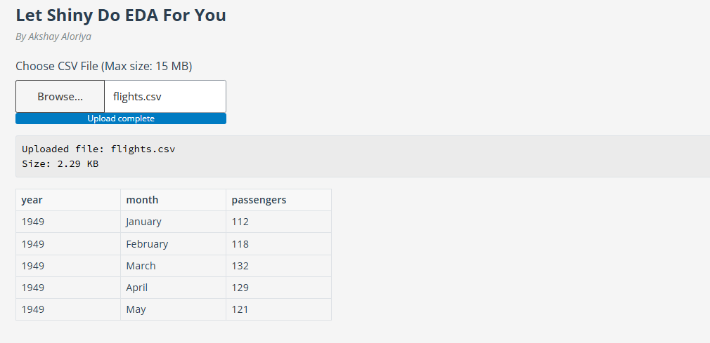
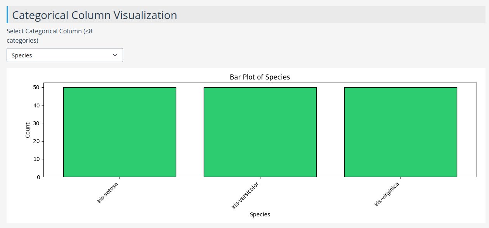
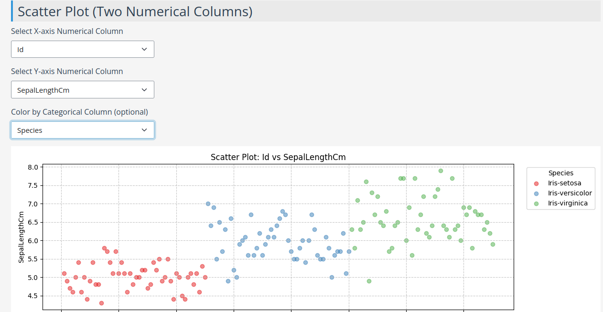

# Let Shiny Do EDA For You

## By Akshay Aloriya

Welcome to **Let Shiny Do EDA For You** — a web application built with **Python Shiny** that automates **Exploratory Data Analysis (EDA)** with beautiful visualizations and interactive controls.

---

## 📂 Features

- **CSV Upload** (up to 15 MB)
- **Dataset Preview** (see first few rows)
- **Summary Statistics** (mean, median, std, min, max, etc.)
- **Missing Value Analysis**
- **Numerical Column Visualizations**:
  - Histograms
  - Boxplots
- **Categorical Column Visualization** (bar plots)
- **Scatter Plots** (with optional class-based coloring)
- **Range-based Filtering** for numerical columns
- **Beautiful Color Theme** for all plots
- **Responsive UI** with dynamic controls

---

## 🖼️ Example Outputs

### 📄 1. File Upload and Dataset Overview



---

### 📊 2. Categorical Column Visualization



---

### 🔵 3. Scatter Plot (Colored by Classes)



---

## 🚀 Running Locally

Follow these steps to run the app on your machine:

1. **Clone the Repository**  
   ```bash
   git clone <repository_name>
   ```

2. **Navigate into the project folder**  
   ```bash
   cd <project_folder_name>
   ```

3. **Install dependencies**  
   Make sure you have **Python 3.9+** installed. Then, run:
   ```bash
   pip install -r requirements.txt
   ```

4. **Run the app**  
   ```bash
   python app.py
   ```
   The app will be available at [http://localhost:8000](http://localhost:8000) by default.

---

## 🛠️ Tech Stack

- **Backend**: Python 3
- **Frontend/UI**: Shiny for Python
- **Plotting**: Matplotlib
- **Data Processing**: Pandas
- **Hosting**: ShinyApps.io

---

## ✉️ Contact

Created with ❤️ by **Akshay Aloriya**  
Feel free to reach out for feedback or contributions!

---
